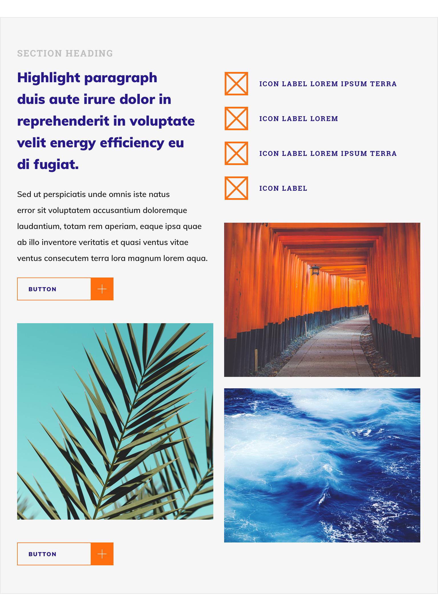
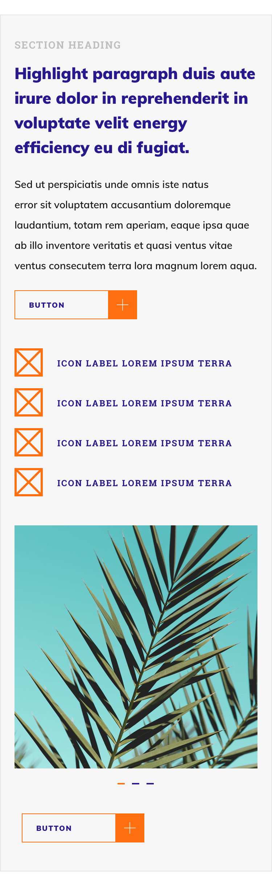

# FrontEndDevTest

The following website was designed on InvisioApp. My task as a coder was to make a responsive website that met the screen layout requirements.

## Invision Design

### Desktop (1920px)

![alt text][desktop]

### Laptop (1366px)

![alt text][laptop]

### Tablet (768px)

### Mobile (375px)

### Style Guide

![alt text][styleguide]

[desktop]: /Invision/Desktop-1920px.png "Screen Size 1920px"
[laptop]: /Invision/Laptop-1366px.png "Screen Size 1366px"
[mobile]: /Invision/Mobile-375px.png "Screen Size 375px"
[styleguide]: /Invision/StyleGuide.png "Style Guide"

## Techniques Used

1. The general layout of this website is done through CSS grid, which provides for easy manipulation and placement of website elements.
2. Font sizes are calculated with min max values based on viewport width.
3. Percentages are used for sizing instead of pixels to have the button and images scale based on size of container/grid.
4. Plus and mail icons are svg instead of png, which scales better with no reduction in clarity.

**Note:** For the purpose of responsive testing, I have introduced blank screen for screen sizes below 320px and above 1921px as they are beyond the scope.

## End Result

https://github.com/josephcheok/FrontEndDevTestv2

1. A very mobile responsive website that does not look odd in any of the screen sizes between 320 to 1920 px.

2. Because vw calc and pecentages are used on sizes instead of hard coded pixels, the website is more scalable.

3. The code is clean and maintainable with minimal code redundancy as all shared styles across different device width are located at the top of the css and styles affected by screen width are mentioned at the different media queries.
